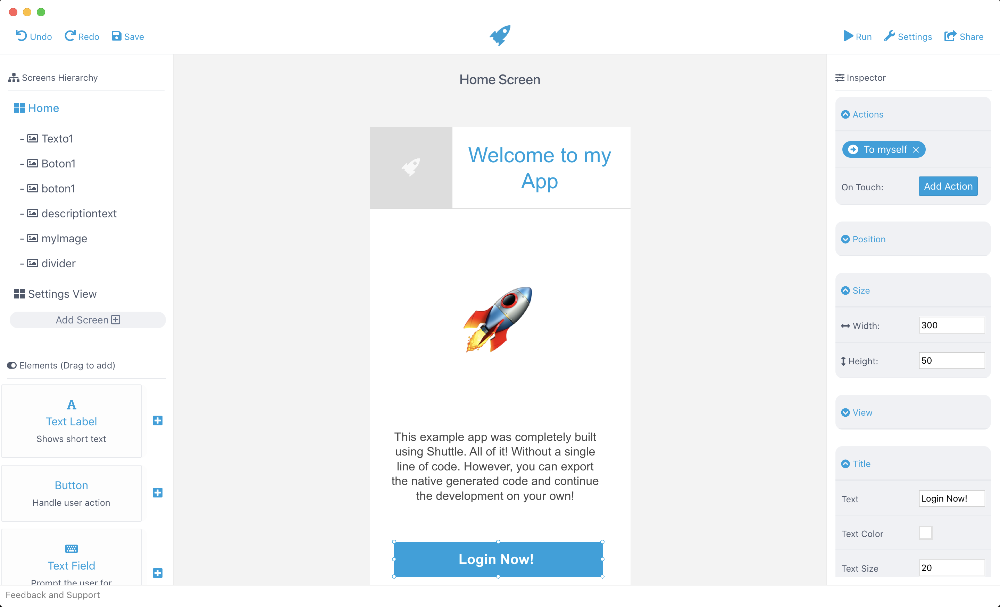

# Shuttle 🚀

Easily create native mobile applications for iOS & Android. No coding required. 100% Native. Automatic UI and Code Generation. Beautiful and easy to use Drag and Drop builder. No app templates, your app is unique.

## Development Status 🏁

- [x] Create Shuttle Projects
- [x] Load Shuttle Project
- [x] Drag and Drop Available elements
- [x] Add elements in the drag and drop editor
- [ ] Add a decent amount of elements
- [x] Edit element attributes
- [x] Add actions and screen transitions
- [x] Export iOS Code
- [ ] Export Android Code (Soon)
- [x] Run in iOS Simulator
- [ ] Run in Android Simulator (Soon)
- [ ] Upload Projects to Shuttle Cloud
- [ ] Add server side connection for the developed apps
- [X] Support macOS, Windows, Linux operating systems
- [ ] Complete Documentation

Currently Shuttle is in public **Beta**. You must remember that this means that there is no guarantee that Shuttle will work perfectly. AppShuttle and the Shuttle programmers are not responsible for Shuttle errors that may cause damage to any work or product, nor for work performed within it. By testing this application while it remains in Beta status, you agree that there is no guarantee of the performance of Shuttle ❤️.

## Download 💻

Shuttle is available as a **Beta Release** for macOS, Windows and linux operating systems.

[Download macOS](#)  
[Download Windows](#)  
[Download Linux](#)  

## Shuttle Tools 🔨

Due to the complexity of Shuttle. There are multiple NPM Modules that make Shuttle a complete solution. Some of them are Open Source and licenced under MIT license. Some of the tools are:

### Open Source 😊
[Shuttle-Pollock](https://github.com/AppShuttleInc/Shuttle-Pollock) - Handle Canvas, Drag & Drop, UI Rendering  
[Shuttle-Turing](https://github.com/AppShuttleInc/Shuttle-Turing) - Code Generation and Project Building  
[Shuttle-Bell](https://github.com/AppShuttleInc/Shuttle-Bell) - Simulators and Device deployment  
[Shuttle-Jobs](https://github.com/AppShuttleInc/Shuttle-Jobs) - Shuttle iOS Showcase and Testing App  

### Proprietary Software 😔
[Shuttle-Cerf](#) - Shuttle Server. Everything ranging from subscriptions, databases, storage, API, etc  
[Shuttle-Cruz](#) - Web app used by the user to administrate projects, subscriptions, account and more  

## Author 👨🏻‍💻

Juan David Cruz Serrano & AppShuttle.io, contact me at: [david@appshuttle.io](mailto:david@appshuttle.io)

## Social

We love to keep you updated on latest news and releases. Follow us on:  

[Instagram](https://instagram.com/AppShuttle.io)  
[Facebook](https://facebook.com/AppShuttle.io)  
[Twitter](https://twitter.com/AppShuttleio)  

## License 📄

Shuttle is available under the MIT license. See the [LICENSE](LICENSE) file for more info.

> This project and all Shuttle tools are in no way affiliated with Apple Inc, Google LLC. This project is open source under the MIT license, which means you have full access to the source code and can modify it to fit your own needs. You are responsible for how you use Shuttle.
